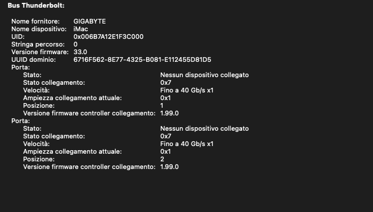
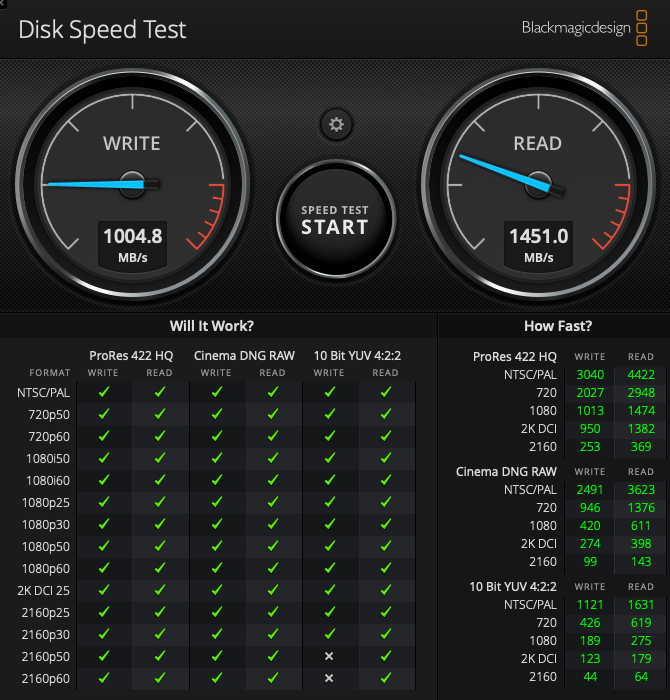
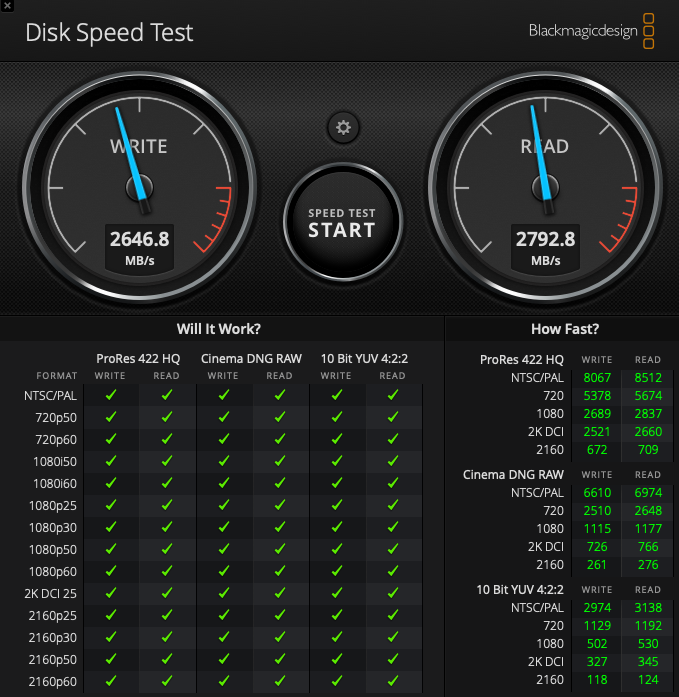
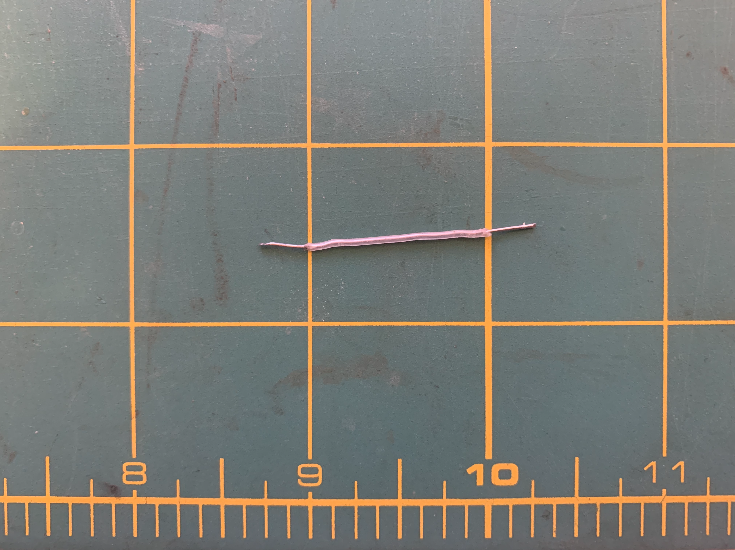
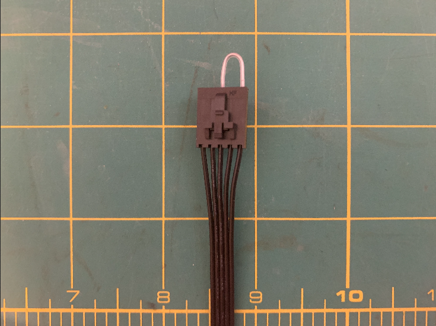
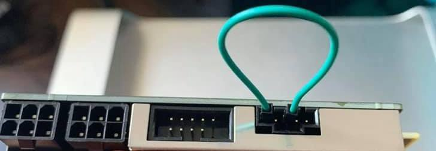
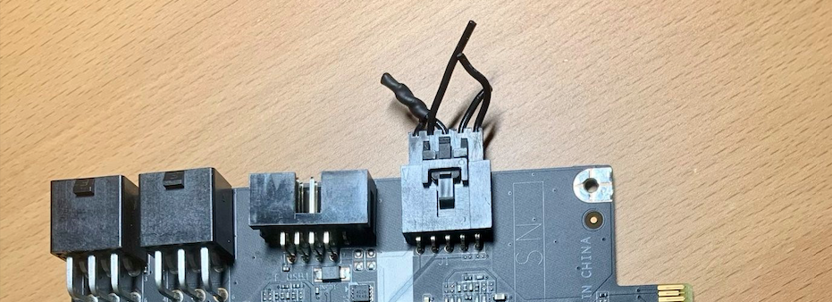

# H270 MSI GAMING M3 + I5 7600 + Thunderbolt 3 GC Titan Ridge :sunglasses:

EFI H270 MSI GAMING M3 +I5 7600 with OpenCore 0.6.6 bootloader

### Computer Spec:

| Component        | Brank                                  |
| ---------------- | ---------------------------------------|
| CPU              | Intel i5-7600                          |
| iGPU             | Intel® Graphics HD 630 (HEADLESS PATCH)|
| dGpu             | Sapphire pulse RX 580 8 GB             |
| Audio            | Realtek ALC1220                        |
| Ram              | 32 GB Corsair Vengeance                |
| Wifi + Bluetooth | Fenvi t919                             |
| Lan              | Killer™ E2500 Gigabit LAN              |
| Thunderbolt 3    | GC Titan Ridge V2 NVM33 ELIAS64FR MOD  |
| NVMe             | Samsung 970 evo plus 1TB ( MacOS)      |
| SSD Sata         | Kingston SSD 1TB (Windows)             |
| SSD Sata         | Kingston a400 2 TB (shared storage)    |
| SmBios           | iMac 18,3                              |
| BootLoader       | OpenCore 0.6.6                         |
| macOS            | Big Sur 11.1                           |

See the [IOREG](https://github.com/basett1/HACKINTOSH-MSI-H270-OPENCORE/blob/main/iMac.ioreg)

### What works and What doesn't or WIP:

- [x] CFG Unlock
- [x] Intel Graphics HD iGPU (use for task only)
- [x] ALC1220 All jack activate
- [x] ALC1220 Combo jack external
- [x] All USB 3.1 Ports (ASM2142 controller)
- [x] Sleep / Wake
- [x] Wi-Fi and Bluetooth
- [x] Controller SATA III
- [x] Controller NVME PciE Gen3x4 
- [x] All Sensors CPU, IGPU, GPU, NVME, SATA, FAN
- [x] Apple VTD
- [x] NVRAM
- [x] Recovery (macOS) boot from OpenCore
- [x] Windows 10 boot from OpenCore
- [x] Thunderbolt 3 GC Titan Ridge V2
- [x] Thunderbolt Hotplug for GC Titan Ridge
- [x] USB C Hotplug For GC Titan Ridge

## Peripherals & Benchmarks

This is the speed test of [Samsung 970 Evo Plus](https://www.samsung.com/uk/memory-storage/nvme-ssd/970-evo-plus-nvme-m-2-ssd-1tb-mz-v7s1t0bw/) mounted in a [SABRENT](https://www.sabrent.com/product/EC-T3NS/thunderbolt-3-to-m-2-nvme-ssd-tool-free-enclosure-ec-t3ns/) enclosure

This is the speed test of internal [Samsung 970 Evo Plus](https://www.samsung.com/uk/memory-storage/nvme-ssd/970-evo-plus-nvme-m-2-ssd-1tb-mz-v7s1t0bw/)

# BIOS
## BIOS VERSION E7A62IMS.270 BUILD DATE 07/03/2018

## Disable cfg lock

To disable cfg lock use the provided kit.

In the folder is provided a dump of BIOS E7A62IMS.270 version for references. 

**THANKS TO [LORYS89](https://github.com/Lorys89) for the hints, BIOS dump and the kit**

Declare tools in config.plist

Reboot the system, when you are at Opencore run modGRUBShell.efi

Type `setup_var 0x526` to interrogate, the result is `Offset 0x526 is: 0x01` this mean that the cfg lock is enabled

Then type `setup_var 0x526 0x00` to write, the result is `Offset 0x526 is: 0x01 setting offset 0x526 to 0x00` this mean that the cfg lock is disabled

Type `EXIT` to return to Opencore Bootloader, Reset nvram and use VerifyMsrE2.efi to check if the cfg lock is disabled.

# BIOS SETTINGS

XMP **[OFF]**

### SETTINGS\ADVANCED

#### PCI Subsystem Settings

PEG0 - Max Link Speed **[Auto]**

PCI Latency Timer **[32 PCI Bus Clock]**

Above 4g memory/Crypto Currency **[Disabled]**

#### ACPI Settings

Power LED **[Blinking]**

#### Integrated Peripherals

Onboard LAN Controller **[Enabled]**

LAN Option ROM **[Disabled]**

Network stacks **[Disabled]**

SATA Mode **[AHCI Mode]**

M.2/Optane Genie **[Disabled]**

SATA 1|6 Hot Plug **[Disabled]**

HD Audio Controller **[Enabled]**

HPET **[Enabled]**

Intel Serial I/O **[Disabled]**

#### Integrated Graphics Configuration

##### I use an headless patch for iGPU just for Apple continuity services

Initiate Graphics Adapter **[PEG]**

Integrated Graphics Share Memory **[128M]**

IGD Multi-Monitor **[Enabled]**

 
#### USB Configuration

USB Controller **[Enabled]**

XHCI Hand-off **[Enabled]**

Legacy USB Support **[Enabled]**

#### Super IO Configuration\ (COM) Port 0 configuration

Serial(COM) Port0 **[Enabled]**

Serial(COM) Port0 Settings **[Auto]**

#### Power Management Setup

ErP Ready **[Disabled]**

Restore after AC Power Loss **[Power off]**

System Power Fault Protection **[Disabled]**

#### Windows OS Configuration

Windows 8.1/10 WHQL Support **[Disabled]**

Windows 7 Installation **[Disabled]**

MSI Fastboot **[Disabled]**

Fast Boot **[Disabled]**

#### Wake Up Event Setup

Setup Wake Up Configuration **[Bios]** 

Resume By RTC Alarm **[Disabled]**

Resume By PCI-E Device **[Disabled]**

Resume By USB device **[Enabled]**

Resume From S3/S4/S5 by PS/2 mouse **[Disabled]**

Resume From S3/S4/S5 by PS/2 keyboard **[Disabled]**

### Special Config
- Usb port mapping performed
- Add ASMEDIA 2142 controller Kext
- SSDT-Hack Essential patch
- SSDT for GC Titan Ridge V2
- Drom flash for GC Titan Ridge V2

# GC Titan Ridge Flash

Follow this [GUIDE](https://www.tonymacx86.com/threads/success-gigabyte-designare-z390-thunderbolt-3-i7-9700k-amd-rx-580.267551/page-1523#post-2079848) to flash the bios provided [here](https://github.com/basett1/OPENCORE-EFI-MSI-H270-GC-TITAN-RIDGE/blob/main/Thunderbolt%203%20DROM/)

**Although the DROM is for DESIGNARE Z390 it works on the GC TITAN RIDGE V2.0** [REFERENCE](https://www.tonymacx86.com/threads/success-gigabyte-designare-z390-thunderbolt-3-i7-9700k-amd-rx-580.267551/post-2226286)

### Connect pin 3 and pin 5 of jumper for Hot Swap capability

Connect pin 3 and pin 5 of the THB_C Header Cable provided for hotplug function. Here some [reference](https://forums.macrumors.com/threads/testing-tb3-aic-with-mp-5-1.2143042/post-28261162).

When connected the jumper from pin 3 to pin 5 should look like this.

Connect this other end of the THB_C Header to the card into the J1 Header port of the card.

Alternate approaches suggested by community:

## Credits

- [Apple](https://apple.com) for macOS.
- [Acidanthera](https://github.com/acidanthera) for OpenCore and all the lovely hackintosh work.
- [Dortania](https://dortania.github.io/OpenCore-Install-Guide/config-laptop.plist/icelake.html) For great and detailed guides.
- [Hackintoshlifeit](https://github.com/Hackintoshlifeit) Support group for installation and post installation.
- [Lorys89](https://github.com/Lorys89) for the continuous support and for the cfg lock tools and info.
- [MBarbierato](https://github.com/mbarbierato) for the support and the infos about thunderbolt.
- [Caseysj](https://github.com/CaseySJ) for the huge work on Thunderbolt.
- [Elias64Fr](https://www.tonymacx86.com/members/elias64fr.2347319/about) for the NVM33 modded firmware.
- [Amey Rupji](https://github.com/ameyrupji) for the precious repo, full of infos about titan ridge. From him the idea of Titan Ridge on hack is started for me.
- [Vorshim92](https://github.com/Vorshim92) for the infos and the tips about Thunderbolt and related works.
# If you need help please contact us on [Telegram](https://t.me/HackintoshLife_it) or [Web](https://www.hackintoshlife.it/).

