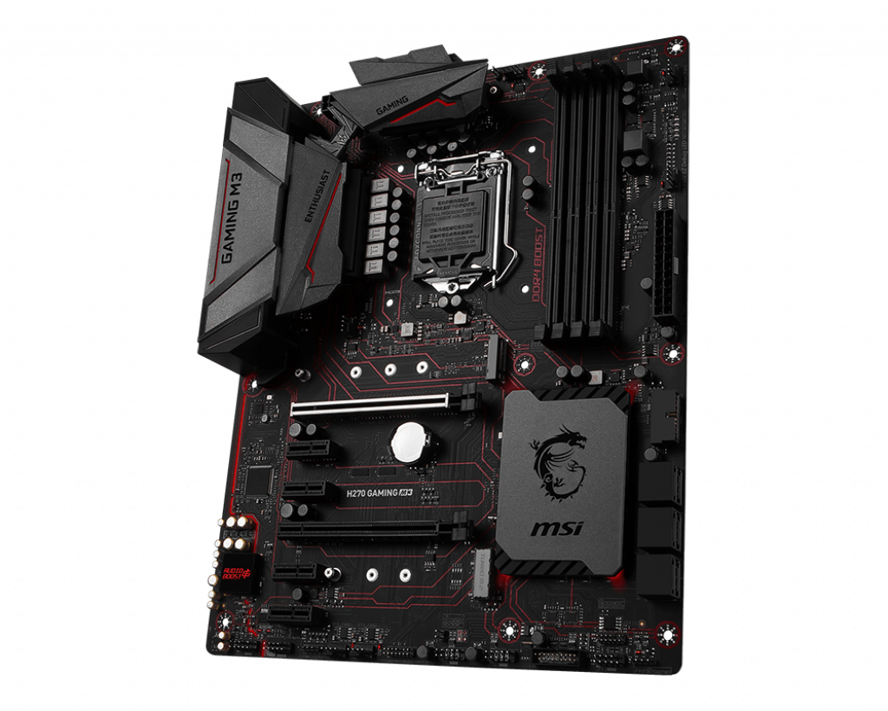
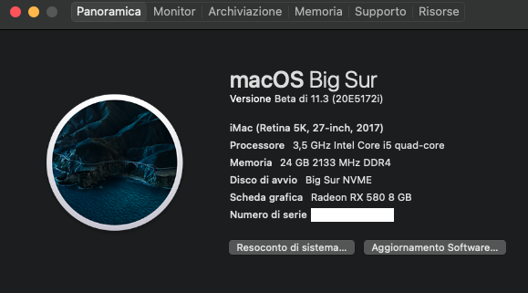
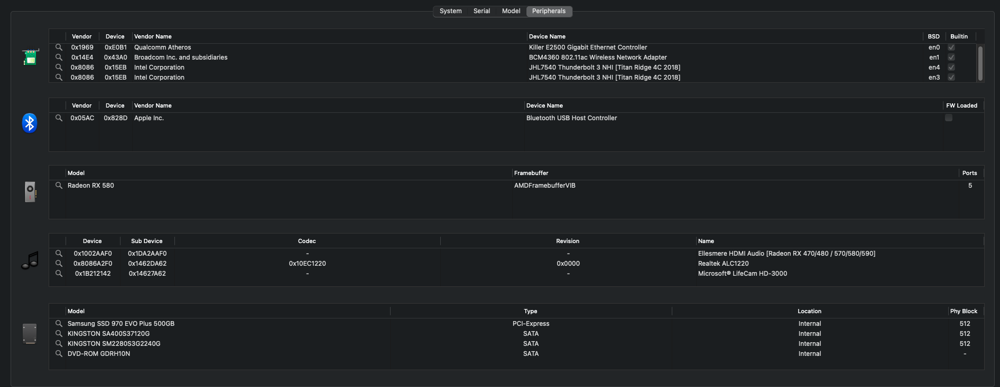
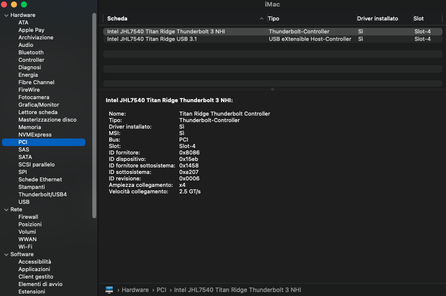
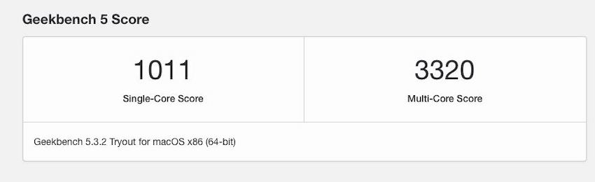
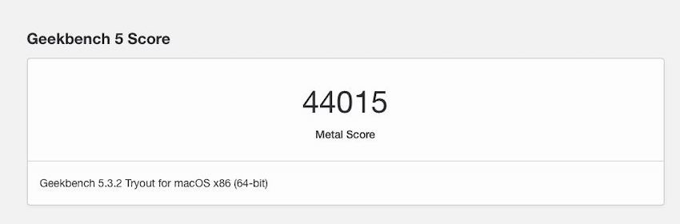
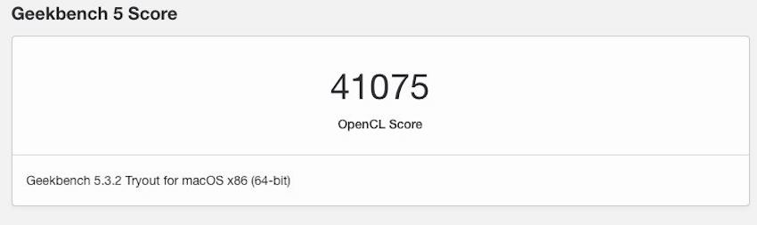
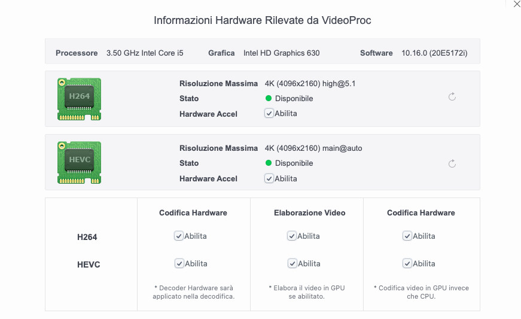

# H270 MSI GAMING M3 + I5 7600 + Thunderbolt 3 GC Titan Ridge

EFI H270 MSI GAMING M3 +I5 7600 with OpenCore bootloader

# The Motherboard don't have anythings related to Thunderbolt 3 but with our group we make it works :sunglasses: 

### Computer Spec:

| Component        | Brank                              |
| ---------------- | ---------------------------------- |
| CPU              | Intel i5-7600                      |
| iGPU             | Intel® Graphics HD 630             |
| dGpu             | Sapphire pulse RX 580 8 GB         |
| Audio            | Realtek ALC1220                    |
| Ram              | 32 GB Corsair Vengeance            |
| Wifi + Bluetooth | Fenvi t919                         |
| Lan              | Killer™ E2500 Gigabit LAN          |
| Thunderbolt 3    | GC Titan Ridge V2                  |
| NVMe             | Samsung 970 evo plus 1TB ( MacOS)  |
| SSD Sata         | Kingston SSD 1TB (Windows)         |
| SSD Sata         | Kingston a400 2 TB (shared storage)|
| SmBios           | iMac 18,3                          |
| BootLoader       | OpenCore 0.6.6                     |
| macOS            | Big Sur 11.1                       |

### What works and What doesn't or WIP:

- [x] CFG Unlock
- [x] Intel Graphics UHD iGPU (use for task only)
- [x] ALC1220 All jack activate
- [x] ALC1220 Combo jack external
- [x] All USB 3.1 Ports (ASM2142 controller)
- [x] Sleep / Wake
- [x] Wi-Fi and Bluetooth
- [x] Controller SATA III
- [x] Controller NVME PciE Gen3x4 
- [x] All Sensors CPU, IGPU, GPU, NVME, SATA, FAN
- [x] Apple VTD
- [x] NVRAM
- [x] Recovery (macOS) boot from OpenCore
- [x] Windows 10 boot from OpenCore
- [x] Thunderbolt 3 GC Titan Ridge V2
- [ ] Hotplug for GC Titan Ridge

## Peripherals & Benchmarks

### Special Config

- Usb port mapping performed
- Add ASMEDIA 2142 controller Kext
- SSDT-Hack Essential patch
- SSDT for GC Titan Ridge V2
- Drom flash for GC Titan Ridge V2

See [ioreg](https://github.com/basett1/HACKINTOSH-MSI-H270-OPENCORE/blob/main/iMac.ioreg) for infos

## Bios settings
WIP

 

## Credits

- [Apple](https://apple.com) for macOS.
- [Acidanthera](https://github.com/acidanthera) for OpenCore and all the lovely hackintosh work.
- [Dortania](https://dortania.github.io/OpenCore-Install-Guide/config-laptop.plist/icelake.html) For great and detailed guides.
- [Hackintoshlifeit](https://github.com/Hackintoshlifeit) Support group for installation and post installation.
- [Lorys89] (https://github.com/Lorys89 for the continuous support and for the cfg lock tools and info
- [MBarbierato] (https://github.com/mbarbierato) for the support and the infos about thunderbolt

# If you need help please contact us on [Telegram](https://t.me/HackintoshLife_it) or [Web](https://www.hackintoshlife.it/)

